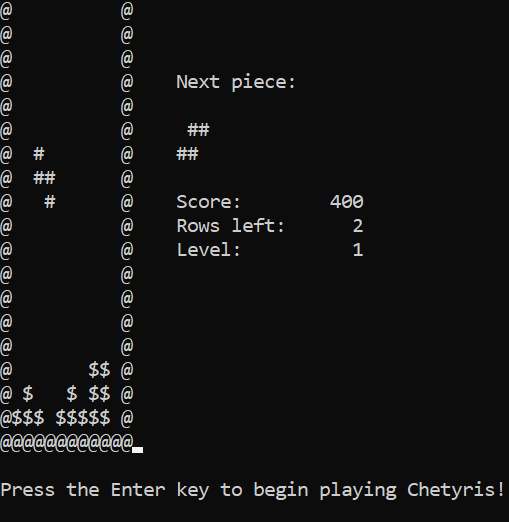

# Tetris

A terminal-based Tetris clone called Chetyris. Created for one of my UCLA computer science courses. `report.pdf` contains justification behind the methods of the various classes.

Note: The `UserInterface` files were provided as starter code. All else is my own work.
